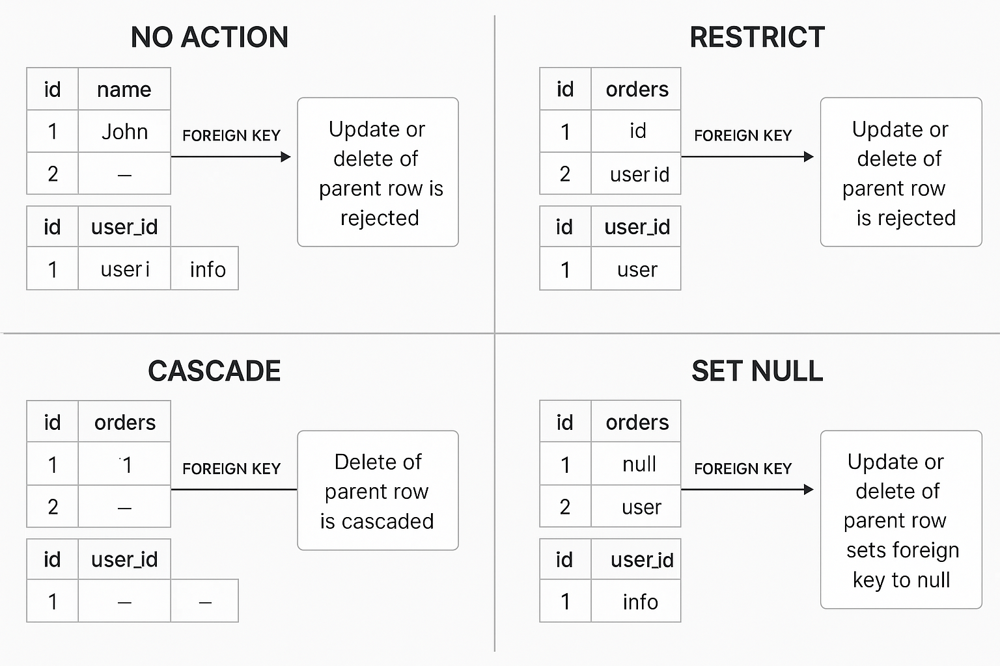

# 📘 Foreign Key in SQL – Complete Guide

This chapter explains the concept, purpose, usage, and referential actions of foreign keys in SQL. It also includes examples and visual aid for better understanding.

---

## 🔑 What is a Foreign Key?

A **foreign key** is a column in one table that refers to the `PRIMARY KEY` in another table. It ensures **referential integrity** between the parent and child tables.

### Example:
**users** table:
| id | name |
|----|------|
| 1  | John |
| 2  | May  |

**orders** table:
| id | user_id | note            |
|----|---------|-----------------|
| 1  | 1       | some info       |
| 2  | 2       | some comments   |

Here, `orders.user_id` is a **foreign key** referencing `users.id`.

---

## 🛠️ How to Create a Foreign Key

```sql
ALTER TABLE orders
ADD CONSTRAINT orders_user_id_fk
FOREIGN KEY (user_id)
REFERENCES users(id);
```

---

## 🔒 Referential Actions

You can specify how the foreign key behaves when the parent data is updated or deleted using:

- `ON DELETE` and `ON UPDATE` options
- Actions: `NO ACTION`, `RESTRICT`, `CASCADE`, `SET NULL`

---

## 🔁 Action Types Explained

| Action      | Description                                                                 |
|-------------|-----------------------------------------------------------------------------|
| NO ACTION   | Prevents DELETE or UPDATE if related data exists. Checked *after* execution.|
| RESTRICT    | Same as NO ACTION, but checked *before* execution.                          |
| CASCADE     | Propagates DELETE or UPDATE to child rows.                                  |
| SET NULL    | Sets the foreign key in the child table to `NULL`.                          |

---

## 🧪 Examples

### NO ACTION / RESTRICT

```sql
ALTER TABLE orders
ADD CONSTRAINT orders_user_id_fk
FOREIGN KEY (user_id)
REFERENCES users(id)
ON DELETE NO ACTION
ON UPDATE RESTRICT;
```
❌ You **cannot delete or update** a user if `orders` still refer to them.

---

### CASCADE

```sql
ALTER TABLE orders
ADD CONSTRAINT orders_user_id_fk
FOREIGN KEY (user_id)
REFERENCES users(id)
ON DELETE CASCADE
ON UPDATE CASCADE;
```
✅ Deleting/Updating a user will **automatically delete/update** their orders.

---

### SET NULL

```sql
ALTER TABLE orders
ADD CONSTRAINT orders_user_id_fk
FOREIGN KEY (user_id)
REFERENCES users(id)
ON DELETE SET NULL
ON UPDATE SET NULL;
```
🔄 Deletes or updates will set `orders.user_id` to `NULL`.

---

## 🖼️ Diagram



---

## ❌ Dropping a Foreign Key

```sql
ALTER TABLE orders
DROP FOREIGN KEY orders_user_id_fk;
```

To update a constraint, first drop it and then add the new one.

---

## 📚 Conclusion

Foreign keys are essential for data integrity and prevent logical errors like orphan records. By choosing the right referential action, you can enforce strict or flexible relationships between your tables.
